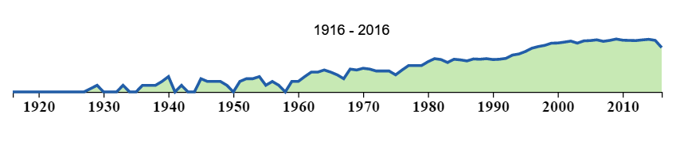
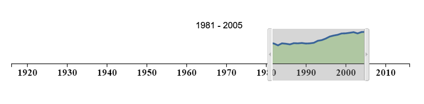
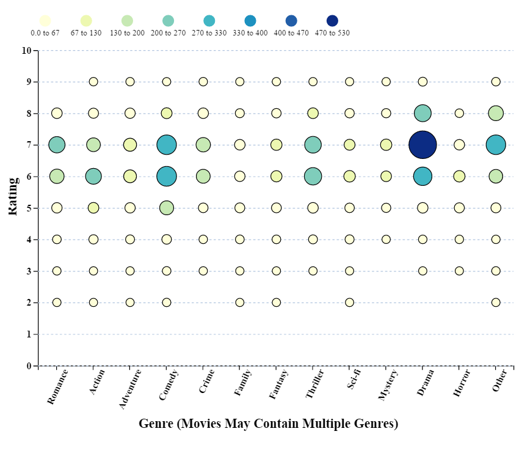
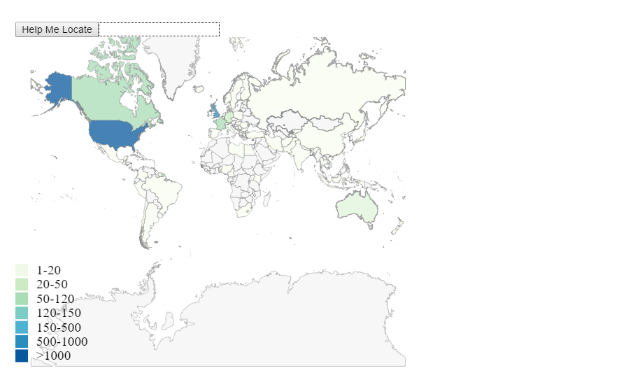
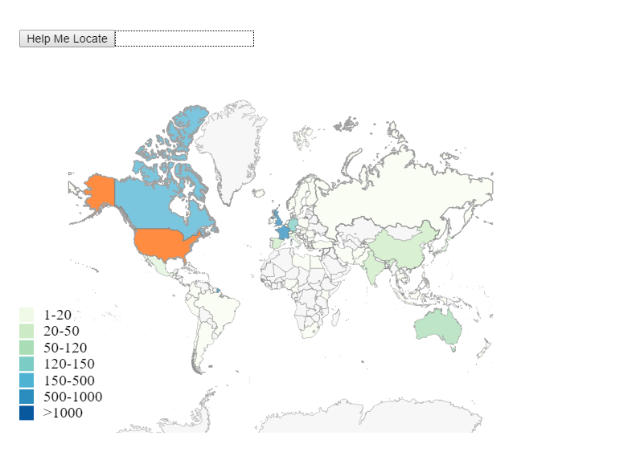
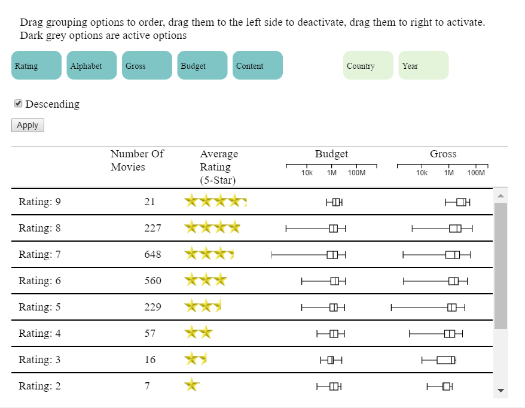
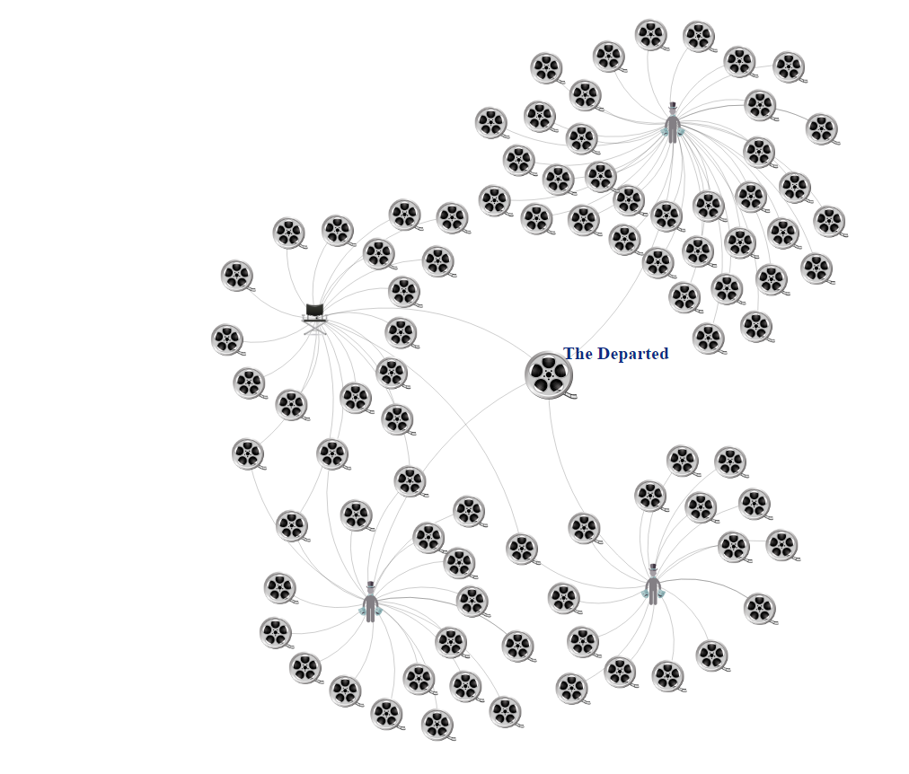
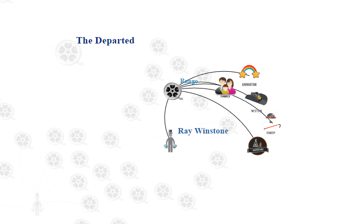
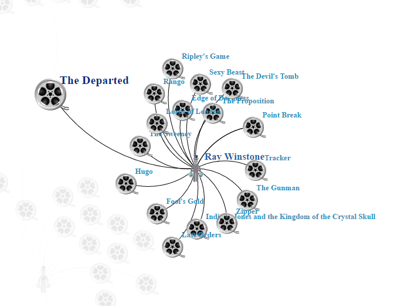

# Movie Miner

*Movie Miner* is a visualization to help users explore movie data and find movies they would want to watch based on features that they themselves can control. The options of features are wide ranging from country, genre and year of production to films in which certian actors and directors collaborated.
The information is based on the [IMDB](https://www.imdb.com) website.

## Main Views

There are two major columns in *Movie Miner*. The left layout (or the sidebar) mainly shows a overall information about the movie data, while the right column is based on a specific movie.
In the left column, there are several views: "*Year Filter*", "*Rating-Genre Filter*", "*Map Filter*", and the "*Table*". In the rightt column, we have placed the "*Graph*" and "*Information*" view.

### Year Filter

This filter helps user to filter movies based on a specific range of consecutive years. The number of movies in each year is presented by a line chart. The main purpose of the line chart here is to give a general idea about the distribution of movies over years. So, there is no Y-axis for this chart. The selection is done by using a brush.

Brush applied in *Year Filter* :

### Rating-Genre Filter

This filter helps user to filter movies based on specific genres and ratings. In this chart the ratings are rounded and the genres with few movies are grouped in one genre, "*Other*". The number of movies in each rating-genre is coded by color and size. Since the number of movies are not distributed evenly, a logarithmic scale is used for both color and size. There is also a search box which helps user to find a specific country on the Map.
Selecting and unselecting is done by clicking on a circle.

### Map Filter

The purpose of the Map filter is to give an insight about the number of movies produced in each country. The map is zoomable nad draggable. The number of movies is coded by a color on each country. The scale here is quantized due to the lopsided nature of the data set so that the colour distribution looks most appealing while giving apt information via the legend.
Selecting and unselecting is done by clicking on a country.

Selecting and unselecting is done by clicking on a country.

### Table

The Table shows the movie list filtered based on the earlier selection in *Year Filter*, *Rating-Genre Filter*, and *Map Filter*. The table has several grouping options: "*Year*", (IMDB) "*Rating*", "*Country*", "*Budget*", "*Gross*", and "*Alphabet.*" (Alphabetical). The user can select and order grouping options by dragging the option buttons. Clicking on "Apply" will apply the grouping on the (filtered) movie set. The table has several columns: grouped title, number of movies, average rating, distribution of gross, distribution of budget. In the table the ratings are converted to 5.0 scale (*E.g.* rating 8.4 will be shown as 4.2). The distribution of gross and budget are shown with [box plots](https://en.wikipedia.org/wiki/Box_plot). The grouping options are applied in sequence. That is by selecting a row of some subgroup, the next grouping option is applied to the movies of that subgroup.
The user can select a movie by clicking on a row displaying information of a single movie (shown with bold text).

### Graph

The purpose of the graph is to explore the relation between actors, movies, and directors. The participation is shown with edges, while nodes indicate movies, actors, or directors. The center of the graph is one specific movie. Hovering on a movie shows the genres of that movie. Clicking on a movie will change the center of the graph to that movie.

When we hover on a movie, the graph shows the following graph:

When we hover on an actor or director, the graph shows the following graph:

### Information

This view displays all the information exists in the datasets and auxiliary websites for a specific movie: "*Title*", "*Year*", "*IMDB Score*"(Rating), "*Director*", first three main "*Actors*", "*Country*", "*Genres*", "*Content Rating*", "*Gross*", "*Budget*", "*Plot*", "*Awards*", and "*Poster*".

## Interaction

The interaction in *Movie Miner* is as follows. 
Initially all the filters and the table are populated based on all the movies in the dataset. 
The user has several options: 

* Brush a range of consecutive years from the *Year Filter*
* Select one or several points (circles) from the *Genre-Rating Filter*
* Select one or multiple countries from the *Map Filter*. 

Performing either of options updates the rest of the filters and the *Table* based on the filter.
Lets consider the following scenario. 

* First, the user select years 1980-1990 from the *Year Filter*.
* The *Genre-Rating Filter* and the *Map Filter* and the *Table* only show information for movies produced between 1980 and 1990. 
* In the next step, the user selects the US and Germany in the *Map Filter*. 
* The *Year Filter* and the *Genre-Rating Filter*, and the *Table* will be updated showing information of movies produced between 1980 and 1990 in the US or Germany.
* Selecting a particular movie from the *Table* will update the *Graph* and the *Information view*. 
* Selecting a different movie in the *Graph* will update the existing *Graph* and the *Information view*.

### Website And Demo

The public website of the visualization is available at [https://saharmehrpour.github.io/dataviscourse-pr-MoviesVisualization/](https://saharmehrpour.github.io/dataviscourse-pr-MoviesVisualization/).

A two-minute demo is available on Youtube: [https://www.youtube.com/](https://www.youtube.com/).
